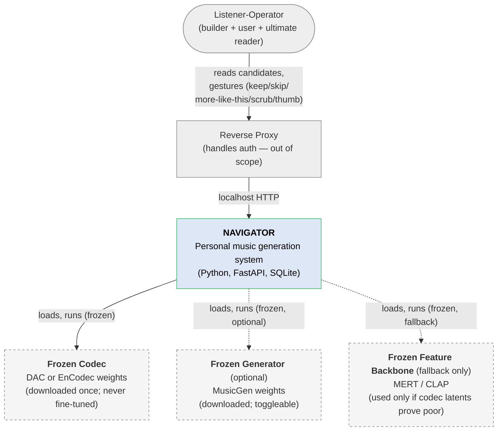
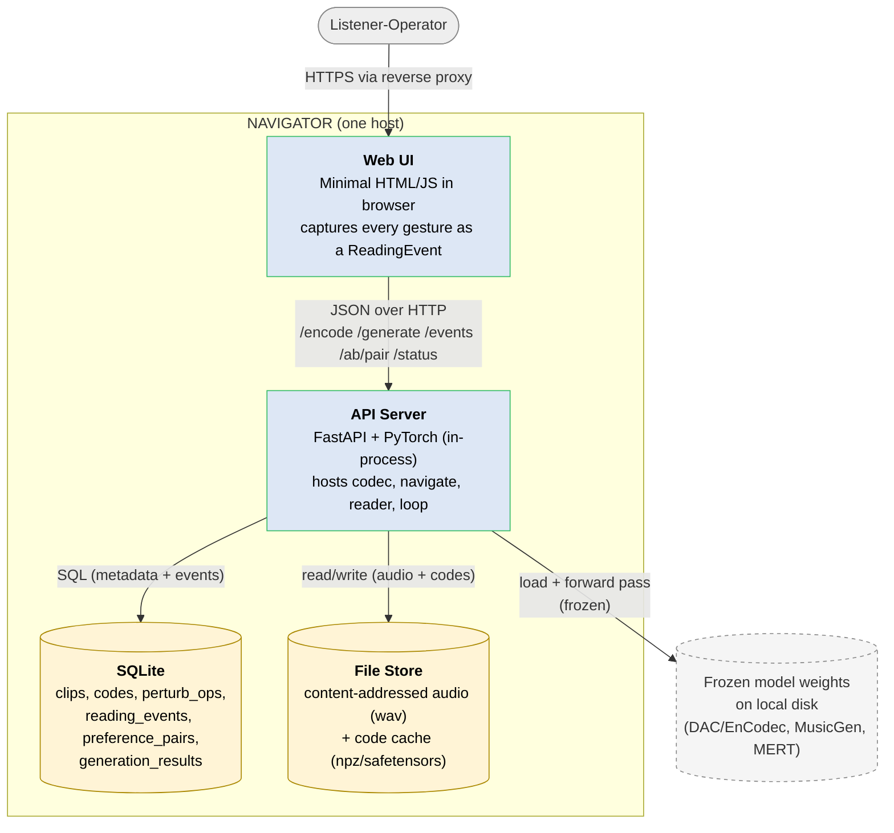
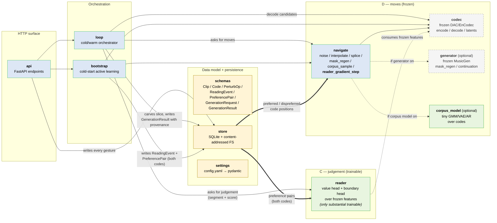
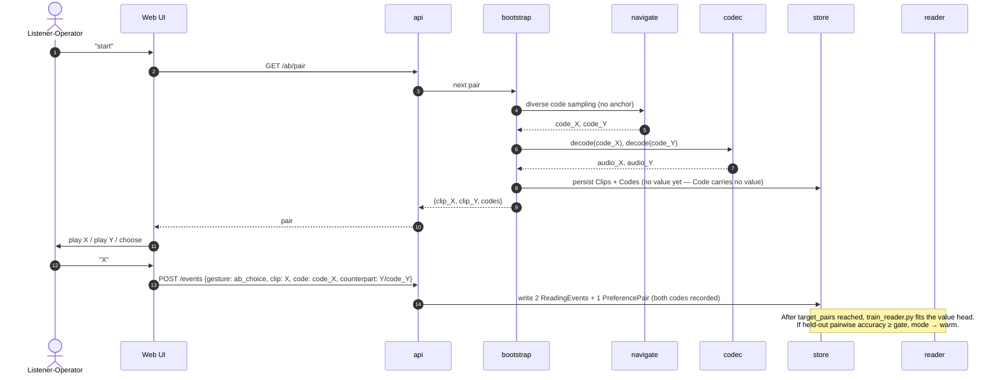
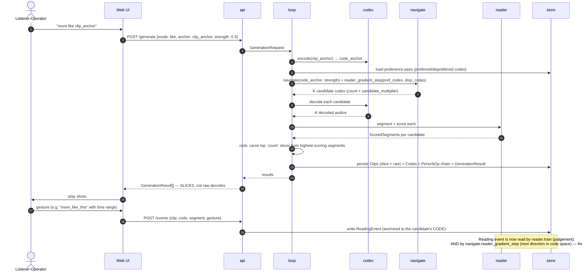

# NAVIGATOR — System Architecture (C4)

This document describes NAVIGATOR using the [C4 model](https://c4model.com)
(Context → Containers → Components). The README states the philosophy; this
document encodes it structurally. If the diagrams ever drift from the
philosophy, the diagrams are wrong.

> The code is durable machinery; value is made at reading.

## Architecturally load-bearing invariants

These are the structural commitments. Code reviews should reject changes that
violate them:

1. **The codec is the invertible map and is FROZEN.** All `audio ⇄ code`
   traffic flows through a single adapter. No other component encodes or
   decodes audio. No component fine-tunes the codec.
2. **The Reader is the only substantial trainable component**, plus an
   optional tiny corpus-code model. Training arrows in every diagram point
   into `reader` (and `corpus_model`), nowhere else.
3. **Reading events are dual-purpose.** Every gesture writes to one place
   (`store`) and is then read by *two* downstream consumers: `reader` (for
   training) and `navigate.reader_gradient_step` (for direction in code
   space). That fork is the synthesis — it is what neither parent design
   has alone. Removing either consumer collapses NAVIGATOR.
4. **Returned songs are Reader-carved slices.** No component ships a raw
   decode out to the user as a song. The carving step happens inside `loop`
   between `codec.decode` and the API response.
5. **Provenance is mandatory.** Every `GenerationResult` carries the
   originating `Code`, the full `PerturbOp` chain, and the Reader's
   segmentation. The schemas refuse to construct a result without them.
6. **Genre tags are optional weak features only.** No component branches on
   them. The pipeline must run with tags stripped.

---

## Level 1 — System Context

NAVIGATOR is operated by one person, on one machine. It depends on a small
number of frozen, downloaded model weights and assumes a reverse proxy
handles authentication (no auth in the app itself).



Notes:

- The **listener-operator is the ultimate reader.** Their gestures train the
  Reader and point a direction in code space. This is not a separate "admin"
  role: there is one user, who is also the dev.
- Dashed arrows mark **optional** dependencies. The system must run with the
  generator disabled and codec latents as the only feature source.
- The reverse proxy is documented but not built. NAVIGATOR binds `127.0.0.1`
  only.

---

## Level 2 — Containers

NAVIGATOR is a single Python process (FastAPI + in-process PyTorch) plus
file-system persistence. There is no message queue, no separate worker, no
remote DB. One person, one process.



Container responsibilities:

| Container | Responsibility | Trainable? |
|---|---|---|
| **Web UI** | Cold-start A/B reading; warm-mode player with "more/less like this part" slider, scrub, thumbs. Every interaction emits a `ReadingEvent` to the API. No localStorage / sessionStorage — server-side state only. | No |
| **API Server** | HTTP surface + orchestration of the cold/warm loop. Owns the in-process Reader. Loads frozen models on startup. | The Reader inside it is. |
| **SQLite** | Metadata and the *durable record of reading*. Reading events and preference pairs live here. Generation provenance lives here. | No |
| **File Store** | Content-addressed audio (sha256-sharded) and code tensors. Codes are large; SQLite holds references only. | No |
| **Frozen weights** (external) | Downloaded once; never written. License table belongs in README. | No (frozen) |

---

## Level 3 — Components inside the API Server

The Python package is `src/navigator/`. Each file is one component. The
diagram shows their dependencies and — more importantly — the **fork of
reading events into two downstream consumers**, which is the synthesis.



Component responsibilities (1-line each — full docstrings live in the source):

| Component | Responsibility | Frozen / trainable |
|---|---|---|
| `settings` | Load `config.yaml` into a pydantic tree. | n/a |
| `schemas` | All data types. The design lives here. | n/a |
| `store` | SQLite + content-addressed audio + code cache. | n/a |
| `codec` | The invertible map. `encode` / `decode` / `latents`. Round-trip ≈ identity. | FROZEN |
| `navigate` | Code-space ops. Houses `reader_gradient_step` (the synthesis op). | FROZEN-arithmetic |
| `reader` | Value head + boundary head over frozen features. Constitutes texts (segments) and confers value. | **TRAINABLE** |
| `generator` | Optional MusicGen for `mask_regen` / continuation. Toggleable. | FROZEN |
| `corpus_model` | Optional tiny model over codes. `sample()` / `score()`. | **TRAINABLE** (few MB) |
| `bootstrap` | Cold-start active learning: diverse codes → forced A/B → preference pairs. | n/a |
| `loop` | The core orchestrator. Cold mode = A/B; warm mode = navigate→decode→read→rank→carve. | n/a |
| `api` | FastAPI HTTP surface. Captures gestures. No auth (reverse proxy handles it). | n/a |

The thick `==>` arrows from `store` to `reader` AND `navigate` are the
**synthesis arrow** — the architectural feature that makes NAVIGATOR more
than the sum of its parents. Every reading event writes one row in `store`
and is consumed twice: once by `reader.train` (to improve judgement) and
once by `navigate.reader_gradient_step` (to set the next direction in code
space). Because both consumers read the same source of truth, the Reader's
judgement and the navigator's direction can never disagree about what
"preferred" means.

---

## Key flows

### Cold start (M3 → M4)



### Warm loop with the synthesis arrow (M5 → M6)



The "synthesis payoff" sentence in step 16 is the architectural punchline:
the same row in `store` simultaneously improves the Reader and tells the
navigator where to move next, with no separate training loop and no
hand-built reward model.

---

## Cross-cutting concerns

### Provenance

Every generated artefact carries its full lineage:

- `Clip.lineage.parent_clip_ids` — human-meaningful anchors (`--like A`, `A↔B`)
- `Clip.lineage.parent_code_ids` — the codes that seeded perturbation
- `Clip.lineage.perturb_op_ids` — every move applied, in order
- `GenerationResult.code` — the candidate code (the code IS the durable mark)
- `GenerationResult.perturb_op_chain` — replayable record of how it was reached
- `GenerationResult.reader_segmentation` — the Reader's carving with per-segment scores

This is checked at schema construction time; you cannot persist a result
without it.

### Frozen vs trainable (the trust boundary)

| Frozen | Trainable |
|---|---|
| `codec` (DAC/EnCodec) | `reader` (value + boundary heads) |
| `generator` (MusicGen, optional) | `corpus_model` (optional, few MB) |
| `features` fallback (MERT/CLAP, if used) | — |

Any PR that adds a `.train()` call or `requires_grad=True` on a frozen
component must stop and re-read the README. If a future need pushes you
to fine-tune the codec, that's a different system.

### Storage layout

```
data/
  audio/<sha256[:2]>/<sha256>.wav        # content-addressed audio
  codes/<code_id>.npz                    # token/latent tensors
  navigator.sqlite                       # everything else
```

The two file stores are append-only by convention; nothing in NAVIGATOR
overwrites a content-addressed path. SQLite rows are mutable for status
fields (e.g. clip metadata) but never for `ReadingEvent` (events are facts
about the past) or `PerturbOp` (provenance).

### Security & auth

- NAVIGATOR binds `127.0.0.1` only.
- The app has no authentication. A reverse proxy handles it.
- There is one user (the operator). No multi-tenant logic exists or is planned.

### Compute

| Step | M4-Pro (CPU/MPS) | 24 GB GPU (CUDA) |
|---|---|---|
| Codec encode (a few seconds of audio) | seconds | sub-second |
| Codec decode | seconds | sub-second |
| Reader train (after cold start, ~40 pairs) | seconds | sub-second |
| Reader train (warm, ~3 000 pairs) | a few minutes | seconds |
| Optional generator forward (MusicGen-small) | tens of seconds | seconds |

(These are rough order-of-magnitude expectations. The README's M8 walkthrough
will quote measured numbers.)

---

## Non-goals (architecturally — not "later")

These are out of scope of NAVIGATOR as designed. If a future need pushes
toward any of them, that is a different system; do not extend NAVIGATOR.

- **Training a codec from scratch.** Cluster + team territory.
- **Training a generator from scratch.** Same.
- **A "proper D" pipeline with evolved/MDL notation.** That is a different
  research project; NAVIGATOR is the runnable fusion.
- **Multi-user / multi-tenant.** One operator. No accounts table.
- **Cloud-managed services.** One host. SQLite + filesystem.
- **A taste corpus seeded by the developer.** Start blank. Taste comes into
  being through use.
- **A "quality gate" that filters whole decodes by yes/no.** That collapses
  the Reader from constitutor to filter; the design is broken.
